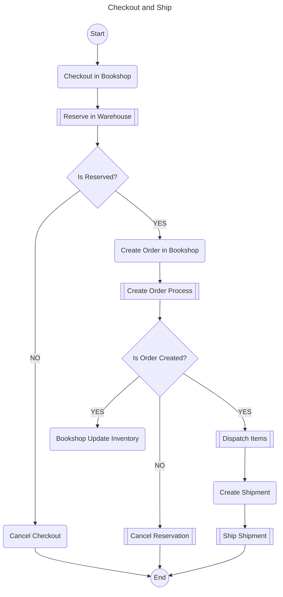

Shipping Process Orchectration
===

> **Note:** _Bookshop is using a Shipping Service Provider to orchestrate the operations._

The Shipping Service Provider exposes Processes as operations from:
* Order management
* Warehousing
* Transport and Delivery (shipping) 
Bookshop is using the processes to orchestrate it's own order management and shipping operations.




## Order Management Operations

### Checkout
Order creation is the responsibility of the bookshop. On checkout, it should trigger a new process, `Order Creation Process`, in SBPA. At the same time it also creates an Order Entity in the bookshop database.

**Order Creation Process**

Inputs:
```
{
    "referenceId": "order id from bookshop", // possibly the businessKey as well
    "items":[
        {
            "itemCode": "item identifier",
            "quantity": 123,
            "price": 12.34
        }
    ],
    "customer": {
        "id": "",
        "address": "",
        "email": "",
        "phone": ""
    }
}
```

Outputs:
```
{
    "orderId": "uuid created in the process",
    "externalReferenceId": "order id from bookshop",
    "status": "CREATED",
    "items":[
        {
            "itemCode": "item identifier",
            "quantity": 123
        }
    ],
    "expectedDeliveryDate": "",
    "customer": {
        "id": "",
        "address": "",
        "email": "",
        "phone": ""
    }
}
```

### Update Order
Change of quantity or Address is generally frequently used cases for end user. Use process `Modify Order Process`, in this case, only considering Quantity changes.

Input:
```
{
    "referenceId": "order id from bookshop", // possibly the businessKey as well
    "type": "UPDATE_QUANTITY",
    "items": [
        {
            "itemCode": "item identifier",
            "quantity": 123
        },
        {
            "itemCode": "item identifier",
            "quantity": 34
        }
    ]
}
```

Output:
```
{
    "orderId": "",
    "referenceId": "order id from bookshop", // possibly the businessKey as well
    "status": "ACCEPTED | REJECTED",
    "updatedPrice": 23.45,
    "rejectionReason": ""
}
```


### Cancel Order
Order can be cancelled fully or partially.
#### Partial Cancellation
> Cancel Order Item(s)

Input:
```
{
    "referenceId": "order id from bookshop", // possibly the businessKey as well
    "cancelItems": ["it_id_1", "it_id_2"]
}
```

Output:
```
{
    "orderId": "",
    "referenceId": "order id from bookshop", // possibly the businessKey as well
    "status": "ACCEPTED | REJECTED",
    "updatedPrice": 23.45,
    "rejectionReason": ""
}
```

#### Full Cancellation
Input:
```
{
    "referenceId": "order id from bookshop", // possibly the businessKey as well
}
```

Output:
```
{
    "orderId": "",
    "referenceId": "order id from bookshop", // possibly the businessKey as well
    "status": "ACCEPTED | REJECTED",
    "rejectionReason": ""
}
```

## Warehouse Operations

### Reserve Items
Inputs:

```
{
    "orderId": "string",
    "items":[
        {
            "itemCode": "item identifier",
            "quantity": 123
        }
    ]
}
```


### Dispatch Shipment

Inputs:

```
{
    "orderId": "string",
    "expectedDispatchTime": "date/time"
    "items":[
        {
            "itemCode": "item identifier",
            "categoryCode": "category code"
        }
    ]
}
```


## Shipping Operations


